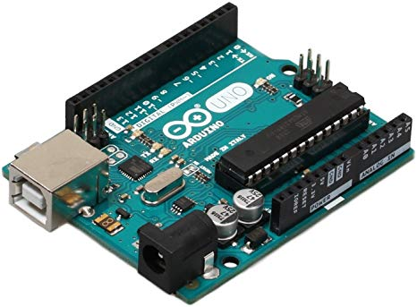

  

# ARDUINO_PROJECTS

> A collection of minor Arduino based projects that I have been working on.

The aim of this repository is to act as a code repository for the sensor testing, minor Arduino projects
undertaken. The code will then avaialable for future use. Arduino is an opensource project more information
can be found on the [arduino repository](https://github.com/arduino/Arduino).

## LIST OF PROJECTS
- [2_AXIS_Laser](2_AXIS_Laser/)
- [Garage_LED_Controller](Garage_LED_Controller/)
- [UBCO](https://github.com/Siddharth10203/Arduino_Projects/tree/master/UBCOpbots_SG)
- [Test](Tests/)

## LICENSES

- **[MIT license](http://opensource.org/licenses/mit-license.php)**
- Copyright 2019 © [Siddharth10203.](https://github.com/Siddharth10203)
